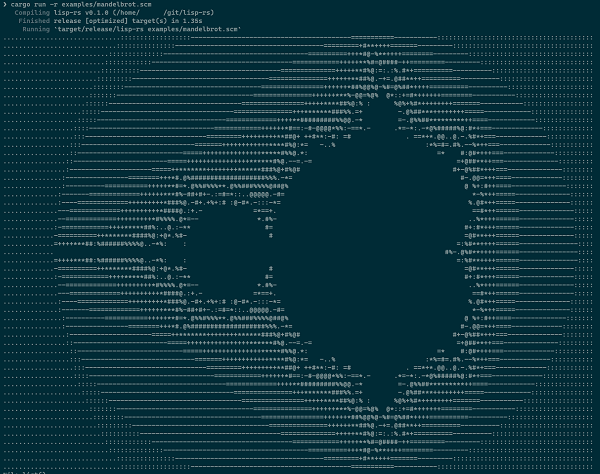

lisp-rs
=========

This is a lisp interpreter written in Rust.

```shell
$ cargo run -r examples/mandelbrot.scm
```



To compile for RISC-V 32, use a option `-c`. 

The compiler outputs `out.bin` and `out.elf`. 
A file `out.bin` is raw instructions.
A file `out.elf` is instructions formatted by ELF.

Note that it is experimental, therefore the compiler fails or outputs invalid code.

```shell
$ cargo run -r -- -c source.scm
```

## Testing

```
$ cargo test
```

To test the compiler, add a feature flag `rv32emu-test`.

Note that it uses [rv32emu](https://github.com/long-long-float/rv32emu.git) as a submodule.

```
$ cargo test --features rv32emu-test
```

## Features

- Basic form and functions (define, if, +, -...)
- Macros
- Statically typed with type inference
- Human readable errors (like rustc)
- REPL
- Optimizing tail recursion
- Generate code for RISC-V (WIP)

## Milestones

- [x] Run FizzBuzz
- [x] Draw Mandelbrot set
- [x] Support statically type system with inference.
- [x] Compiler for RISC-V
- [ ] Implement a lisp interpreter running in lisp-rs.

## Reference

* https://schemers.org/Documents/Standards/R5RS/HTML/
* https://cs61a.org/articles/scheme-spec/
